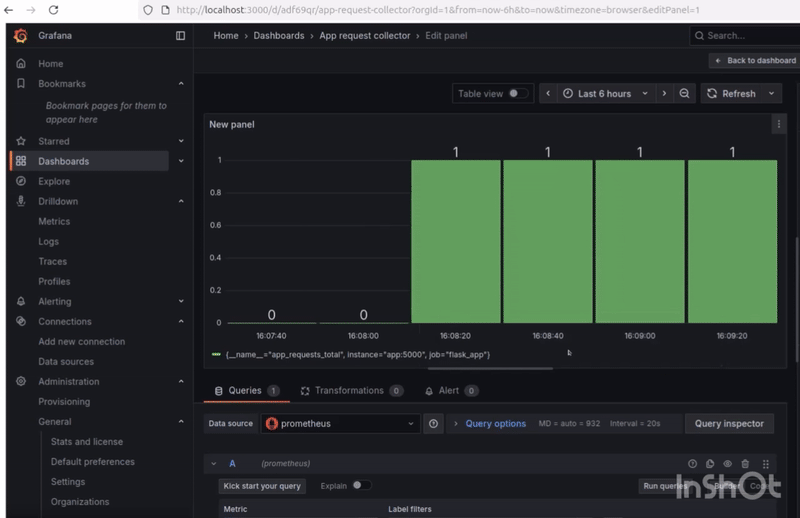

# 📊Flask Monitoring with Prometheus & Grafana

---

**CLICK ON TECH STACK TO SEE HOW  I USED THESE TOOLS IN MY WORK**

## ⚙️ Tech Stack

# Monitoring & Observability:

---

# Backend Technologies:

---

# DevOps & Infrastructure:

🧠 This project demonstrates real-time monitoring and observability using Prometheus, Grafana, Flask, and Docker Compose.
The goal is to show how monitoring tools can visualize live metrics from an application — helping engineers detect, analyze, and improve system performance.

📝 Project Overview

- Before implementing monitoring, there was no easy way to see how the Flask application behaved internally — metrics like request count, response time, and errors were hidden.

- After integrating Prometheus and Grafana, I could visually observe:

- How many times the app endpoints were accessed.

- Response durations and uptime.

- The overall health and performance of the service.

- This project highlights the importance of observability — knowing exactly what’s happening inside your systems through data.

---

# 🎯Key Features

- Real-time tracking of Flask metrics

- Prometheus scrapes metrics from the /metrics endpoint

- Grafana visualizes data with interactive dashboards

- Docker Compose manages all services together

- Demonstrates a full DevOps-style monitoring workflow

---

# 📂 Project Structure

monitoring-project /

├── app.py  /              # Flask application exposing /metrics

├── prometheus.ym l/       # Prometheus scrape configuration

├── docker-compose.yml/   # Defines Prometheus, Grafana, Flask containers

├── requirements.txt/   # Flask and Prometheus client dependencies

└── README.md /           

---

# 🎥 Demo

**This demo shows how Grafana updates live metrics from the Flask app**

After refreshing the Flask app several times, Grafana’s graph instantly shows the increase — **moving from 1 to 16 requests.**
This proves that Prometheus is collecting data in real time and Grafana is displaying it visually, showing how activity on the app directly affects the monitoring dashboard.

---

# 🧰 Setup & Run

1️⃣ Clone the Repository

- git clone <repo-url>
- cd monitoring-project

  ---
  2️⃣ Build and Start the Services
  
- docker-compose up -d

---

3️⃣ Access the Services

- Flask app → http://localhost:5000

- Prometheus → http://localhost:9090

- Grafana → http://localhost:3000

  ---

  4️⃣ Stop Services
  
- docker-compose down

  ---

🧠 Problems & Solutions
🧱 Before (No Monitoring)

❌ Could not see if the app was running properly or how many users accessed it.
❌ No visibility into performance, errors, or uptime.

⚙️ After (With Prometheus + Grafana)

✅ Prometheus automatically collects live metrics from the app.
✅ Grafana visualizes them through graphs and dashboards.
✅ Engineers can now spot spikes, latency issues, and failures in real time.

---

🧩 Commands Used
# Check running containers
- docker ps

# View container logs
- docker-compose logs prometheus
- docker-compose logs grafana

# Restart containers
- docker-compose restart

# Stop and remove containers
- docker-compose down

---

# 🧠 What I Learned

- Prometheus → How it scrapes metrics from services and stores them for analysis.

- Grafana → How to visualize Prometheus metrics using dynamic dashboards.

- Flask → How to expose application metrics via the /metrics endpoint.

- Docker Compose → Running multiple services (app, Prometheus, Grafana) together easily.

- Observability Importance → Realized how monitoring helps detect, debug, and optimize services before issues impact users.

 
---

**Prometheus monitoring the Flask app on port 5000**

This screenshot shows that Prometheus successfully scraped and collected metrics from the Flask service, confirming that the application is healthy and being tracked in real time.

---

**All containers running using Docker Compose**

This proves that Prometheus, Grafana, and the Flask app were all started together through Docker Compose — saving time and effort by running multiple containers with a single command.

---

**Flask app being monitored by Prometheus and Grafana**

This is the application whose metrics are being collected and visualized. It represents how modern DevOps teams track their running services using open-source monitoring tools.

----

